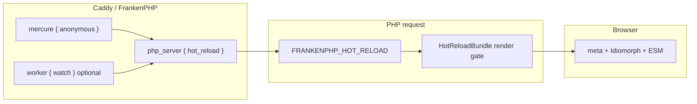

# Environment setup (FrankenPHP + Caddy)

This bundle only injects **browser** Hot Reload assets. The **server** must run FrankenPHP with Mercure and `hot_reload`. If that side is missing, the Symfony config can be perfect and nothing will happen.

Official references: [FrankenPHP Hot Reload](https://frankenphp.dev/docs/hot-reload/) · [dunglas/frankenphp-hot-reload](https://github.com/dunglas/frankenphp-hot-reload).

**Dev only.** Do not enable `hot_reload` or this bundle in production. See [Security](SECURITY.md).

## Table of contents

- [How the pieces fit](#how-the-pieces-fit)
- [Minimum checklist](#minimum-checklist)
- [1. Register the bundle (`dev` / `test` only)](#1-register-the-bundle-dev--test-only)
- [2. Symfony YAML](#2-symfony-yaml)
- [3. Caddyfile — classic](#3-caddyfile--classic)
- [4. Caddyfile — worker + watch](#4-caddyfile--worker--watch)
- [5. `FRANKENPHP_HOT_RELOAD` (do not put this in `.env`)](#5-frankenphp_hot_reload-do-not-put-this-in-env)
- [6. Optional `mercure_url`](#6-optional-mercure_url)
- [7. Docker / Compose](#7-docker--compose)
- [Validate the setup](#validate-the-setup)
- [Confirm it works in the browser](#confirm-it-works-in-the-browser)
- [Troubleshooting](#troubleshooting)

## How the pieces fit



| Layer | What you configure | Who sets it |
| --- | --- | --- |
| Caddyfile | `mercure { anonymous }` + `php_server { hot_reload }` (+ `worker { watch }` in worker mode) | You / ops |
| Process env | `FRANKENPHP_HOT_RELOAD` = Mercure hub URL (often `/.well-known/mercure?topic=…`) | **FrankenPHP on each HTTP request** — not Symfony, not `.env` |
| Bundle YAML | `nowo_hot_reload.*` (`enabled`, `auto_inject`, `require_frankenphp_env`, …) | You |
| Optional fallback | `nowo_hot_reload.mercure_url` | You, only if the env var never reaches PHP |

The **render gate** opens when `enabled` is true **and** (`mercure_url` or `FRANKENPHP_HOT_RELOAD` is non-empty, **or** `require_frankenphp_env: false`). Details: [Configuration](CONFIGURATION.md#render-gate).

## Minimum checklist

Do these in order. Skip optional rows if the previous ones already work.

1. **Bundle** registered for `dev` / `test` only (`config/bundles.php`).
2. **YAML** `nowo_hot_reload.enabled: true` (and `auto_inject: true` unless you call the Twig helper).
3. **Caddyfile** has `order mercure after encode`, `mercure { anonymous }`, and `php_server { hot_reload }`.
4. **Worker mode:** also `worker { file …; watch }` (without `watch`, PHP workers will not pick up file changes).
5. Recreate the FrankenPHP container / process after Caddyfile or Compose env changes (`docker compose up -d`, not a plain `restart` for env).
6. Load an **HTML** page over HTTP (not `bin/console`).
7. Run `php bin/console nowo:hot-reload:check` and open the Web Debug Toolbar **Hot Reload** panel.

## 1. Register the bundle (`dev` / `test` only)

```php
// config/bundles.php
return [
    // ...
    Nowo\HotReloadBundle\NowoHotReloadBundle::class => ['dev' => true, 'test' => true],
];
```

Flex does this via the recipe. `allow_production: false` (default) rejects `enabled: true` when `kernel.environment` is `prod`. See [Installation](INSTALLATION.md).

## 2. Symfony YAML

Recommended for local development (`config/packages/dev/nowo_hot_reload.yaml` or `config/packages/nowo_hot_reload.yaml`):

```yaml
nowo_hot_reload:
    enabled: true
    auto_inject: true
    require_frankenphp_env: true
    allow_production: false
    # mercure_url: null   # leave unset — FrankenPHP fills FRANKENPHP_HOT_RELOAD
    idiomorph: true
```

Leave `mercure_url` unset when FrankenPHP is configured correctly. Full option list: [Configuration](CONFIGURATION.md).

## 3. Caddyfile — classic

Use this when each request is a new PHP process (`FRANKENPHP_MODE=classic` in this repo’s demo).

```caddyfile
{
	frankenphp
	order mercure after encode
}

:80 {
	root * /app/public
	encode zstd br gzip

	mercure {
		anonymous
	}

	php_server {
		hot_reload
	}
}
```

`order mercure after encode` is required so Mercure is in the HTTP chain. `anonymous` is expected for local Hot Reload — do not expose that hub on a public production host.

## 4. Caddyfile — worker + watch

Use this when FrankenPHP keeps a long-lived worker (`FRANKENPHP_MODE=worker`). **`watch` is required** or file saves will not reload the worker.

```caddyfile
{
	frankenphp
	order mercure after encode
}

:80 {
	root * /app/public
	encode zstd br gzip

	mercure {
		anonymous
	}

	php_server {
		hot_reload
		worker {
			file ./public/index.php
			watch
		}
	}
}
```

Adjust `file` to your front controller (Docker images often use `/app/public/index.php`). You can add extra `watch` paths (Twig, assets) — see the [official Hot Reload guide](https://frankenphp.dev/docs/hot-reload/).

## 5. `FRANKENPHP_HOT_RELOAD` (do not put this in `.env`)

When `hot_reload` is on, FrankenPHP sets `$_SERVER['FRANKENPHP_HOT_RELOAD']` for **HTTP** PHP requests. Typical value:

```text
/.well-known/mercure?topic=https%3A%2F%2Ffrankenphp.dev%2Fhot-reload%2F…
```

| Context | Will you see the variable? |
| --- | --- |
| Browser request → FrankenPHP → Symfony | Yes (this is the real signal) |
| `php bin/console …` | **No** — CLI is not going through `php_server { hot_reload }` |
| `.env` / `$_ENV` | **Do not set it yourself.** A stale URL here does not replace Caddy Mercure. |

A **warn** on `FRANKENPHP_HOT_RELOAD` from `nowo:hot-reload:check` in the CLI is expected. Confirm the same row on the profiler after loading a page.

## 6. Optional `mercure_url`

Set this only if PHP never receives `FRANKENPHP_HOT_RELOAD` (unusual process manager, missing `hot_reload`, or tests):

```yaml
nowo_hot_reload:
    mercure_url: 'http://localhost/.well-known/mercure'
```

Prefer fixing Caddy so FrankenPHP injects the env var. The fallback URL must be the hub the **browser** can reach.

## 7. Docker / Compose

This repository’s demo is documented in [DEMO-FRANKENPHP.md](DEMO-FRANKENPHP.md). The same rules apply to any FrankenPHP Compose stack:

| Rule | Why |
| --- | --- |
| Mount or `COPY` the Caddyfile that contains `mercure` + `hot_reload` | Image default Caddyfile may not include Hot Reload |
| `APP_ENV=dev` and bundle enabled for `dev` | The bundle is skipped in `prod` by default |
| After changing `.env` (`FRANKENPHP_MODE`, ports, …) run `docker compose up -d` | `restart` does **not** reload container environment |
| After changing the Caddyfile, recreate or reload Caddy | Workers keep the old config until replaced |
| `FRANKENPHP_MODE=worker` vs `classic` | Worker needs `worker { …; watch }`; classic uses plain `php_server { hot_reload }` |

## Validate the setup

Same checks in CLI and in the profiler (pass / fail / warn + “what to do”):

```bash
php bin/console nowo:hot-reload:check
php bin/console nowo:hot-reload:check --caddyfile=docker/frankenphp/Caddyfile
php bin/console nowo:hot-reload:check --json --strict
```

The command auto-detects `Caddyfile`, `docker/frankenphp/Caddyfile`, and `Caddyfile.dev` (classic mode prefers `.dev`).

Then open an HTML page with the Web Debug Toolbar:

1. Toolbar **Hot Reload** should be **on** (green) when assets were injected.
2. Panel **Environment checks** lists the same rows as the command.
3. Long Mercure URLs are truncated in the toolbar (`/.well-known/mercure?...`); hover for the full value.

## Confirm it works in the browser

1. View source: `<meta name="frankenphp-hot-reload:url" … data-nowo-hot-reload>` plus scripts with `data-nowo-hot-reload` before `</head>`.
2. Edit a Twig template or PHP file and save. In worker mode with `watch`, the page should morph (Idiomorph) or reload.
3. JSON/API responses are never injected (`Content-Type` must be HTML).

## Troubleshooting

| Symptom | Likely cause | What to do |
| --- | --- | --- |
| Profiler status **idle**, `FRANKENPHP_HOT_RELOAD` empty | Caddy missing `hot_reload` or not the Caddyfile you think | Enable `php_server { hot_reload }`, recreate the container, load the page again |
| CLI check **warn** on `FRANKENPHP_HOT_RELOAD` | CLI cannot see the HTTP env | Expected. Use the profiler on an HTML page |
| CLI check **fail** on Caddy mercure / hot_reload | Scanned Caddyfile has no those directives | Pass `--caddyfile=` to the file FrankenPHP actually loads |
| Assets missing with `auto_inject: false` | Layout does not call the helper | Add `{{ nowo_hot_reload_assets() }}` in `<head>` or turn `auto_inject` on |
| Gate open but not injected | Non-HTML, empty body, or snippet already present | Load a full HTML document |
| Worker ignores file saves | No `watch` in `worker { }` | Add `watch` (and extra watch paths if needed) |
| Env change in `.env` has no effect | Container not recreated | `docker compose up -d` (not `restart`) |
| `InvalidConfigurationException` in `prod` | `enabled: true` with `allow_production: false` | Keep the bundle off in production |
| Scripts blocked by CSP | CDN / inline preserve script | See [CSP.md](CSP.md) |
| Toolbar morphs away | Preserve selectors | Defaults cover `#sfwdt` / `.sf-toolbar`; see [Usage](USAGE.md#preserve-toolbar--custom-dom) |

More usage detail (Twig, preserve, template overrides): [Usage](USAGE.md). Demo stack: [Demo (FrankenPHP)](DEMO-FRANKENPHP.md).
